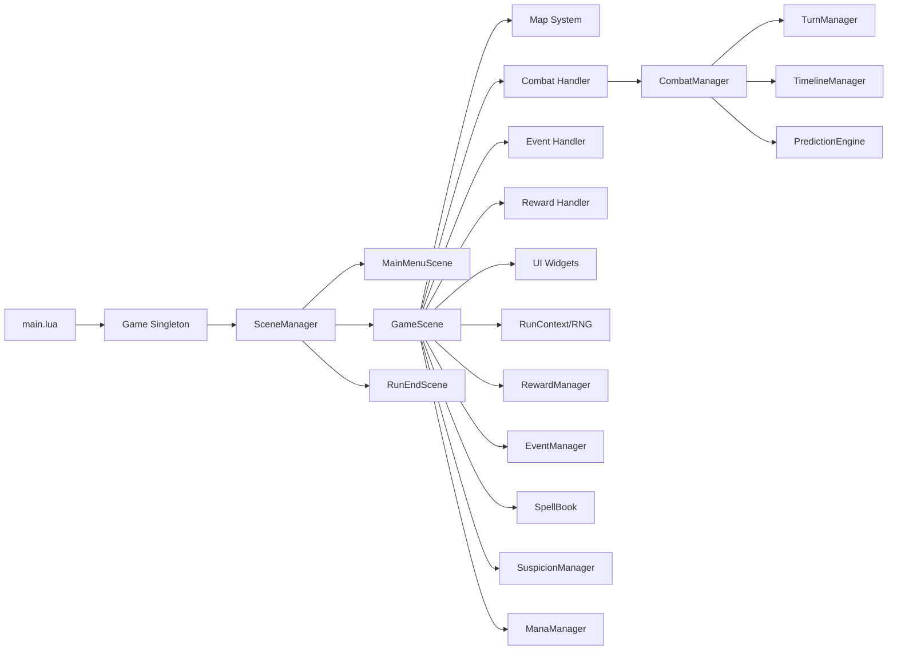
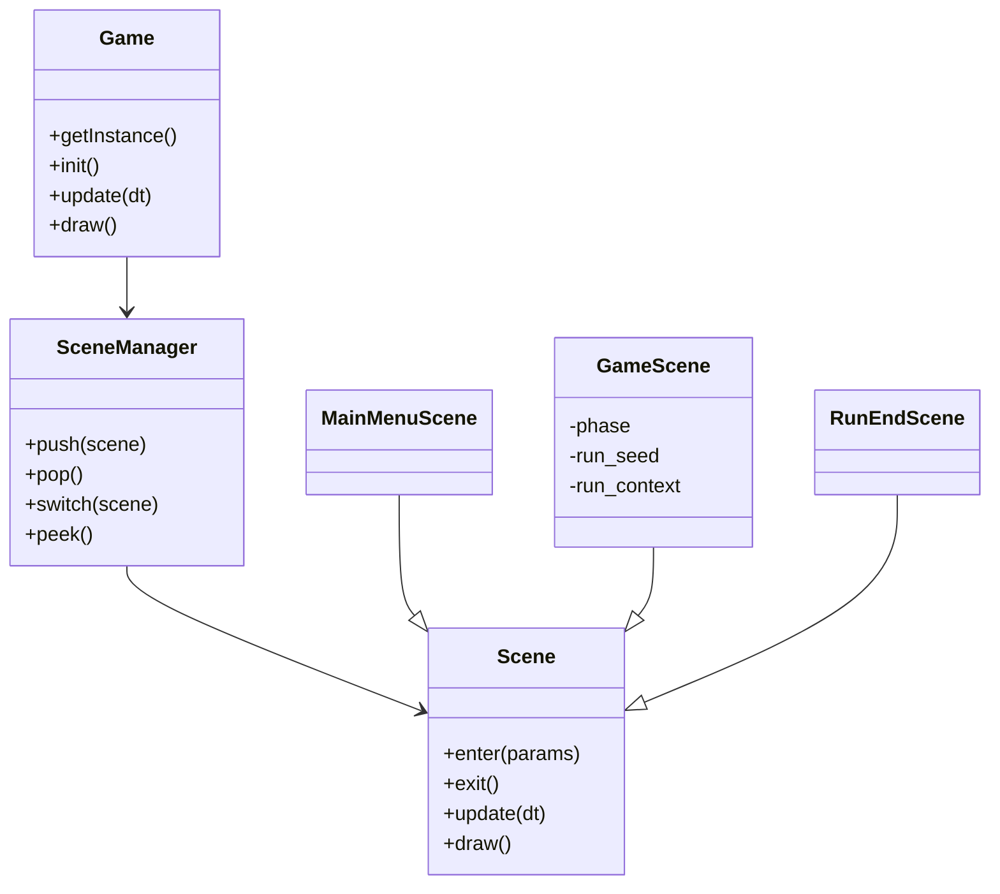
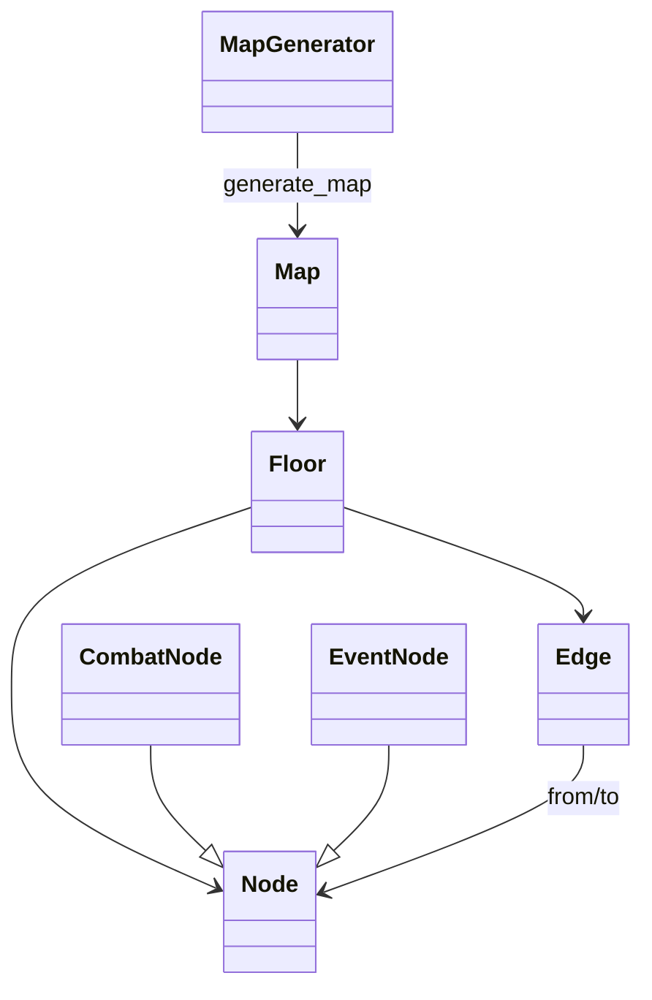
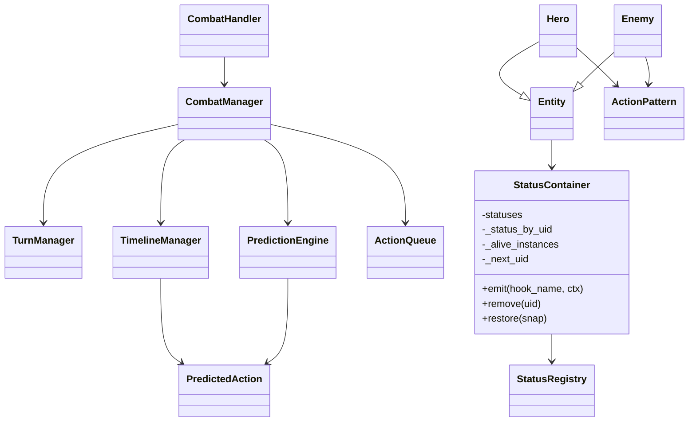
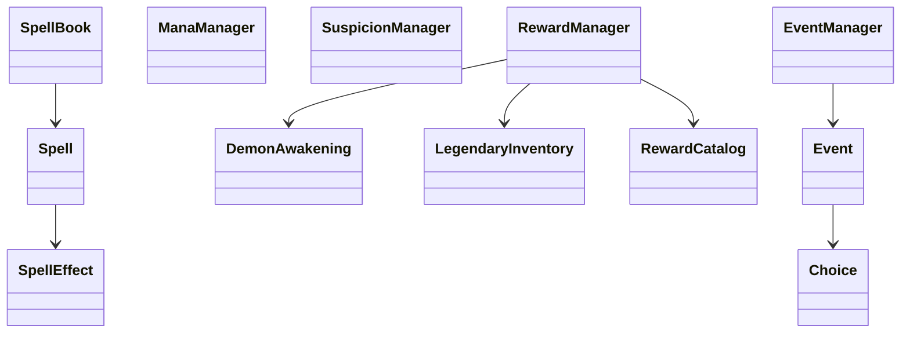
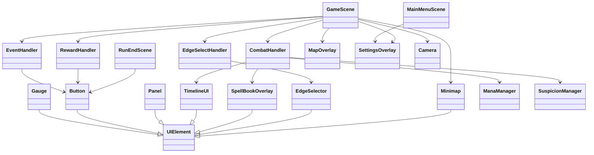

# 클래스 다이어그램 (현재 코드 기준)

이 문서는 `origin/main`의 실제 클래스 구조를 요약합니다.
과거 문서에 있던 `MapScene/CombatScene`, `Deck/Card` 중심 구조는 현재 코드와 다릅니다.

## 1) 상위 구성도

## 2) Core / Scene 계층

## 3) 맵 시스템

## 4) 전투/예측/상태 시스템

상태 컨테이너 메모:

- `StatusContainer`는 상태 목록 외에 UID 인덱스와 생존 인덱스를 함께 유지합니다.
- `emit()`은 snapshot 순회 + `_alive_instances` 확인으로, 순회 도중 제거된 상태 hook를 다시 호출하지 않는 것을 보장합니다.
- `remove()`와 `restore()`는 UID 변경/복원 이후에도 `_status_by_uid`가 stale alias를 남기지 않도록 재매핑 책임을 집니다.

## 5) 주문/보상/이벤트 시스템

## 6) 핸들러 / UI 계층

## 7) 주요 변경 포인트(문서 동기화용)

- 씬 구조: `MainMenuScene` / `GameScene` / `RunEndScene`
- 런 복귀: active save 1개 + 체크포인트 복원 방식
- 저장 아키텍처: data-only save + participant registry + backup fallback
- 개입 구조: `Deck/Card`가 아니라 `SpellBook/Spell` 중심
- RNG: 전역 `math.random` 의존이 아니라 `RunContext` 스트림 RNG
- 정산: `RewardManager` + `DemonAwakening` + `LegendaryInventory` 큐 기반

## 문서 메타

- 문서 기준: `origin/main`
- Last Updated: 2026-03-12
