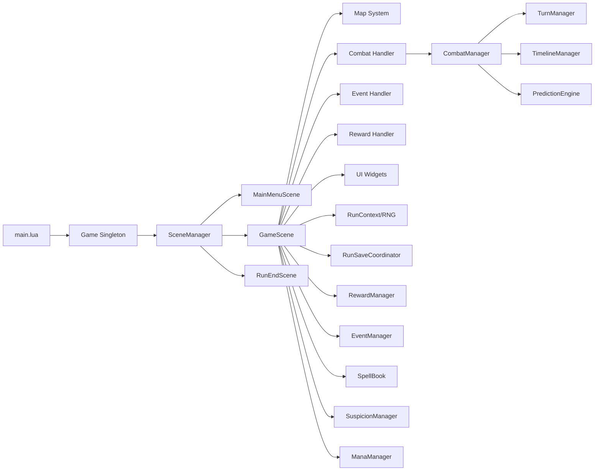
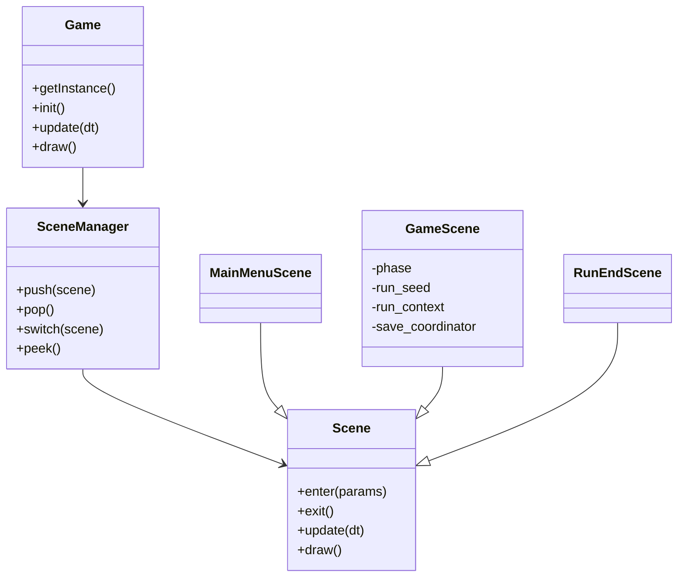
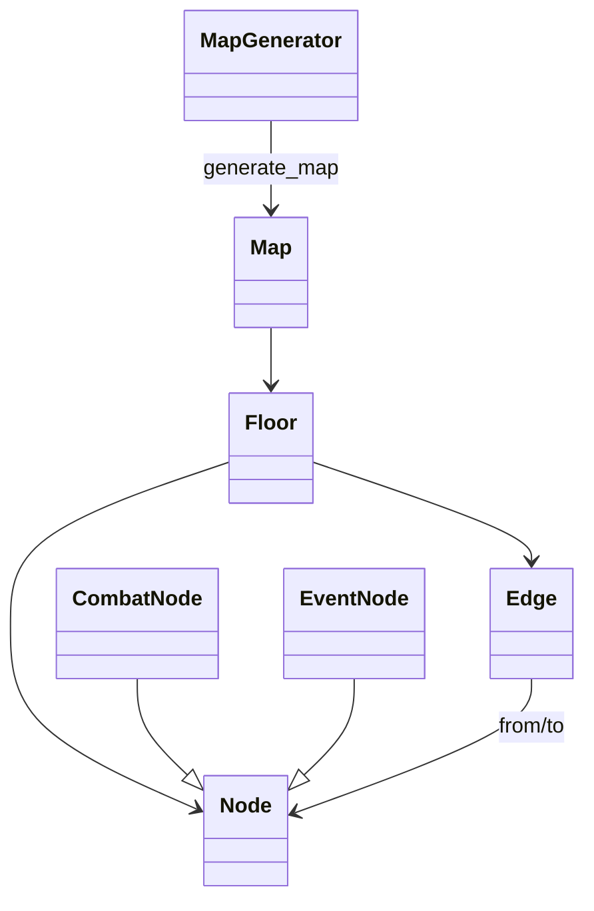
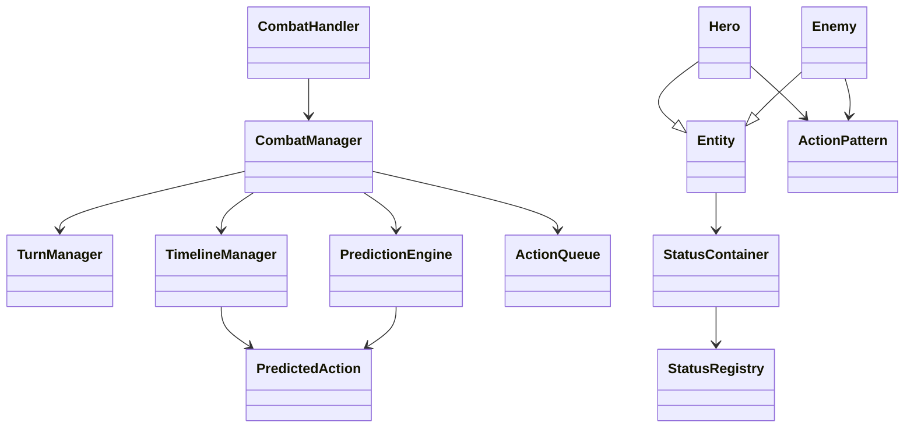
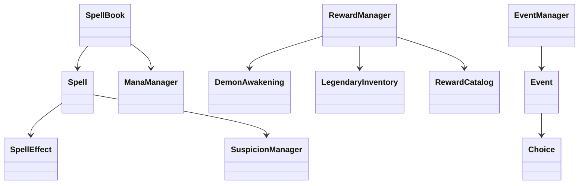
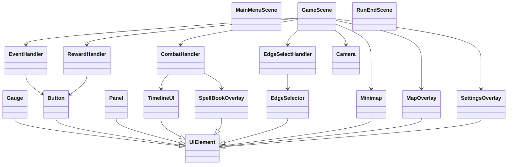

# Class Architecture

이 문서는 현재 코드 기준 클래스 구조를 요약합니다.

## 1) 상위 구성도

## 2) Core / Scene 계층

## 3) 맵 시스템

## 4) 전투/예측/상태 시스템

상태 컨테이너 메모:

- `StatusContainer`는 상태 목록 외에 UID 인덱스와 생존 인덱스를 함께 유지합니다.
- `emit()`은 snapshot 순회와 생존 확인으로, 순회 도중 제거된 상태 hook를 다시 호출하지 않도록 설계됩니다.
- `remove()`와 `restore()`는 UID 변경/복원 이후에도 stale alias가 남지 않게 재매핑 책임을 집니다.

## 5) 주문/보상/이벤트 시스템

## 6) 핸들러 / UI 계층

## 7) 변경 포인트

- 씬 구조는 `GameScene` 통합형입니다.
- 개입 구조는 `Deck/Card`가 아니라 `SpellBook/Spell` 중심입니다.
- RNG는 `RunContext` 스트림 RNG를 사용합니다.
- 정산은 `RewardManager` + `DemonAwakening` + `LegendaryInventory` 큐 기반입니다.

## 출처

- 루트 호환성 포인터: [`../../../CLASS_DIAGRAM.md`](../../../CLASS_DIAGRAM.md)
